# Thesis - Method to automatic detection and measurement of nuchal translucency
## Introduction
Độ mờ gia gáy là phần dịch lỏng tích tụ dưới phần gáy của thai nhi ở tuần tuổi thứ 11 - 14, phần độ mờ này hiển thị trên ảnh siêu âm là vùng diện tích nằm giữa 2 vùng hồi âm sáng. Đo độ mờ gia gáy là một công cụ để phân tích chuẩn đoán trước sinh liên quan tới các khuyết tật bẩm sinh nhiễm sắc thể như hội chứng Down.
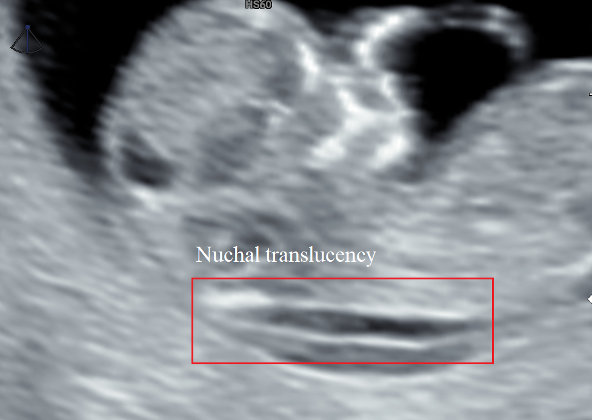
Khóa luận này bắt chước các bước làm thủ công của bác sĩ trong suốt quá trình tiến hành xác định độ dày phần da gáy để xây dựng một hệ thống cho phép tự động phân tích, xác định và đo đạc độ mờ gia gáy. Hệ thống được chia thành 2 phases:
1. Phát hiện độ mờ gia gáy
2. Đo độ mờ gia gáy
### Clear input and output
- Input: Một ma trận MxNx3 đại diện cho ảnh siêu âm thai nhi.
- Output: Độ giày phần độ mờ gia gáy tính theo (mm).
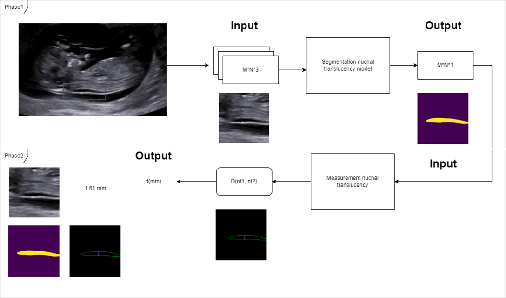
## Background
Bộ dữ liệu sử dụng bao gồm 738 ảnh siêu âm thai nhi được cung cấp bởi bệnh viện phụ sản trung ương. Tuy nhiên có tới 62.9% số lượng ảnh đã bị đánh giấu gây hỏng dữ liệu, cần phải tiền xử lý trước hoặc sử dụng phương pháp lọc và tăng cường dữ liệu. Quá trình gán nhãn được các bác sĩ kết hợp cùng thực hiện.
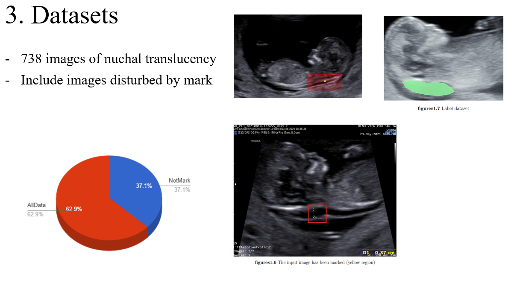
## Methodology
Khóa luận này đề xuất phương pháp sử dụng mô hình CNN Unet để giải quyết phase thứ 1. và sử dụng kỹ thuật xử lý ảnh để giải quyết phase thứ 2. Bên cạnh đó còn sử dụng thêm các kỹ thuật tăng cường dữ liệu để cải thiện bộ dữ liệu.
### Segmentation
Mô hình Unet CNN được sử dụng với cải tiến ở lớp đầu ra và quá trình trích xuất features của ảnh, sao cho ảnh đầu ra có kích thước cùng với ảnh đầu vào, và là ảnh nhị phân để phù hợp với phase thứ 2.
Unet là một mạng CNN gồm các khối convolution, pooling,... nối nhau chia thành 2 nửa giống như một khối encoder và decoder. Tuy nhiên khác với encoder và decoder, Unet phân loại ảnh trên từng pixel điểm ảnh. Unet không có lớp fully connected, thay vào đó nó sử dụng các kết nối tắt để nối các đặc trưng đảm bảo không mất mát. Input cho quá trình training của Unet theo thuật toán Image2Image, input gồm một cặp ảnh (root, result).
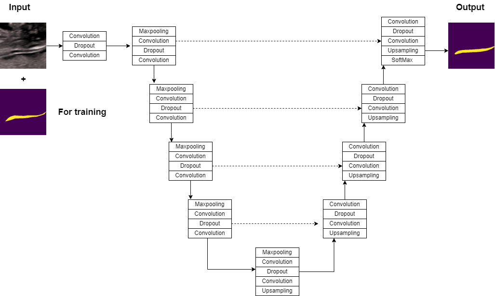
#### Loss function
Hàm mất mát được sử dụng là hàm CrossEntropy tuy nhiên vì unet phân loại từng pixel điểm ảnh nên hàm mất mát được viết lại như sau:
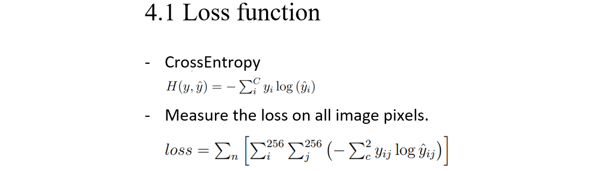\
256 là kích thước của ảnh đầu vào.
## Experiments
Kết quả của 3 thí nghiệm trên các tập dữ liệu và với kỹ thuật data augmentation như sau:\
EXP1:\
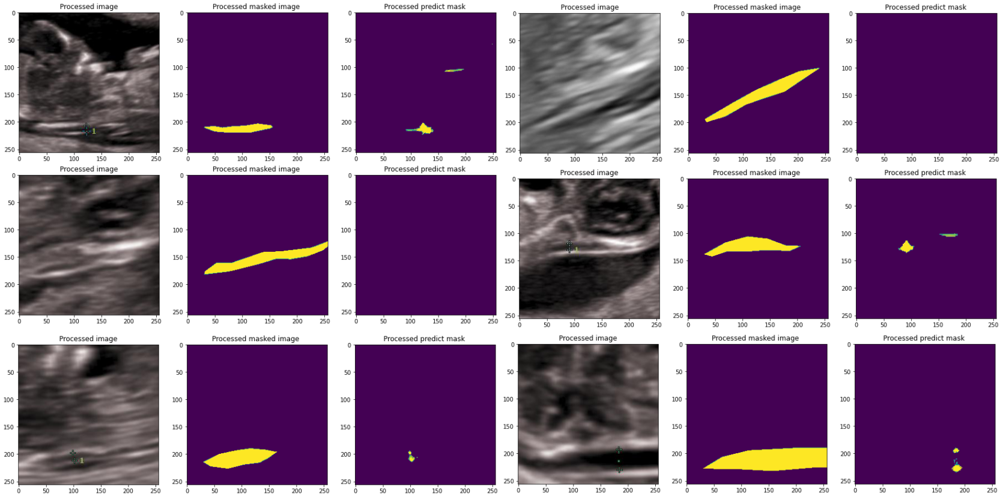
EXP2:\
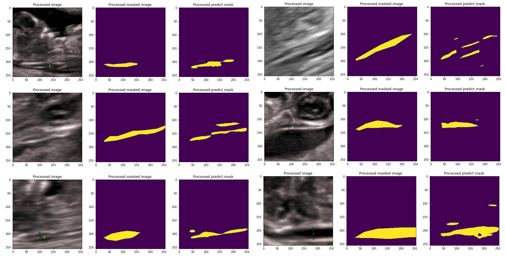
EXP3:\
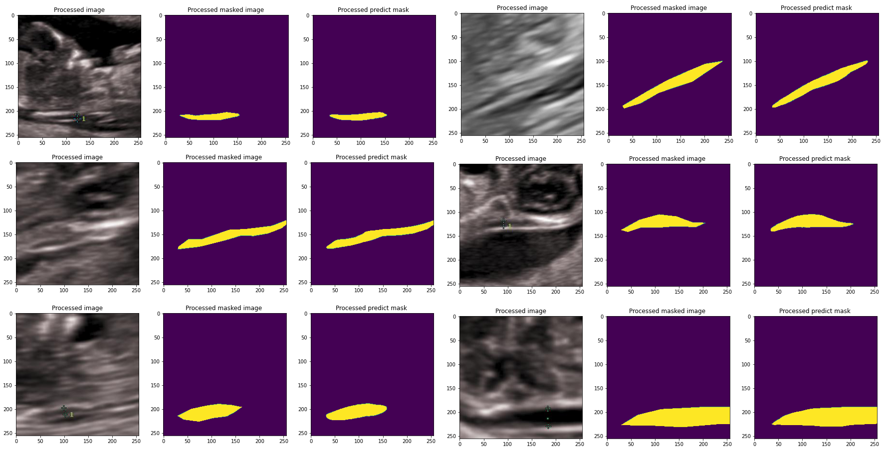
### Measurement
Để phù hợp cho tính toán và theo các đa số nhận định chủ quan tôi định nghĩa 2 điểm NT (nuchal translucency) nằm đối xứng nhau qua tâm của phần diện tích gia gáy. Quá trình tính toán được mô tả như sau:\
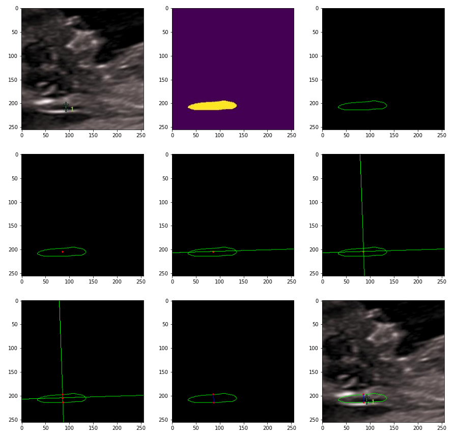\
Để thực hiện chuyển đổi đơn vị trên tọa độ pixel chúng tôi dụng thêm thuộc tính DPI trong in án ảnh. Một số minh họa kết quả như sau:\
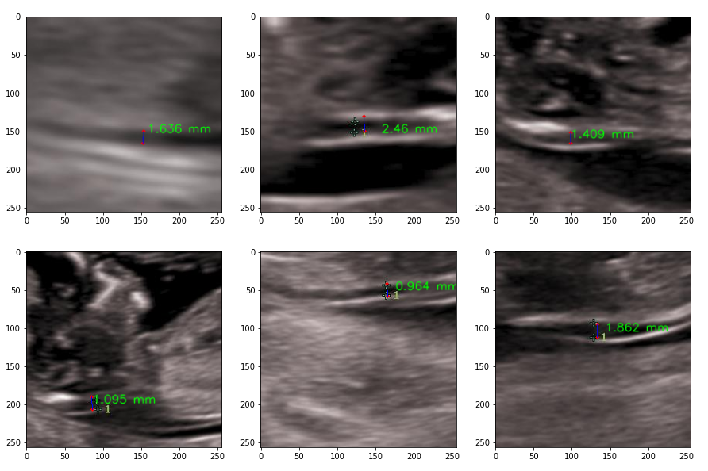
## Deployment
Để thực tiễn hóa quá trình đo đạc tôi triển khai mô hình lên nền tảng web, với một usercase cơ bản để minh họa rõ hơn quá trình của hệ thống.
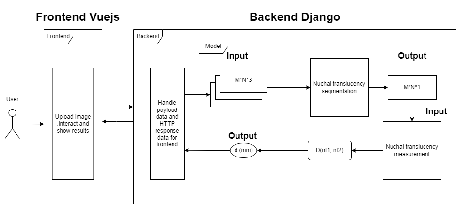
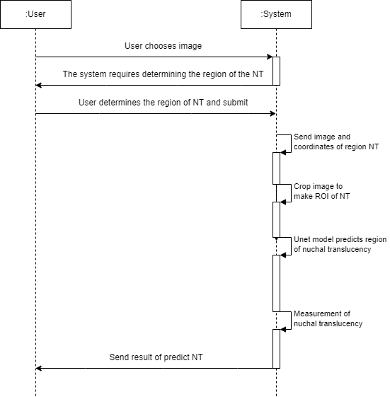
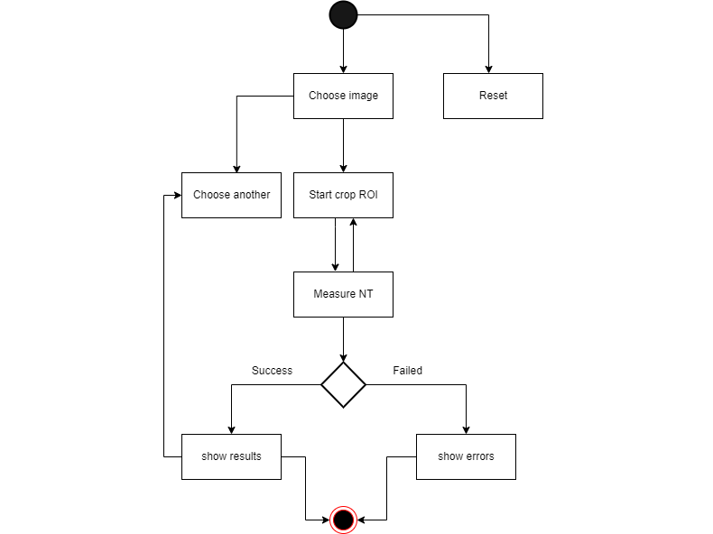\
Xem thêm video tại đây:\
[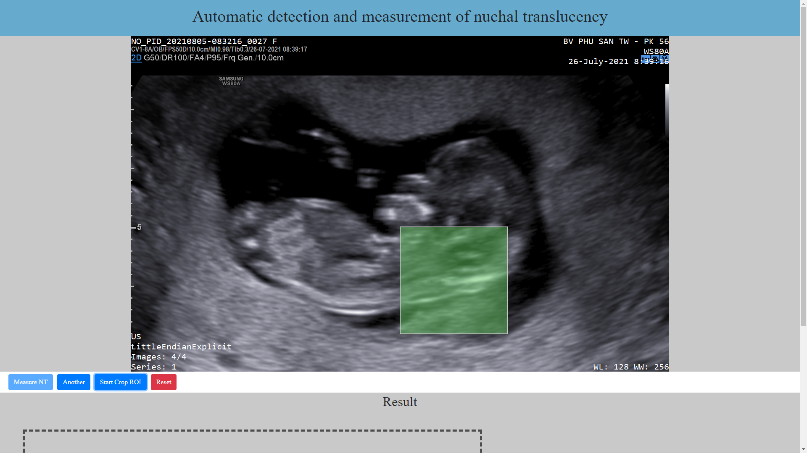](https://youtu.be/CXR_Owqq6ro)
## Results
Kết quả phase thứ 1.\
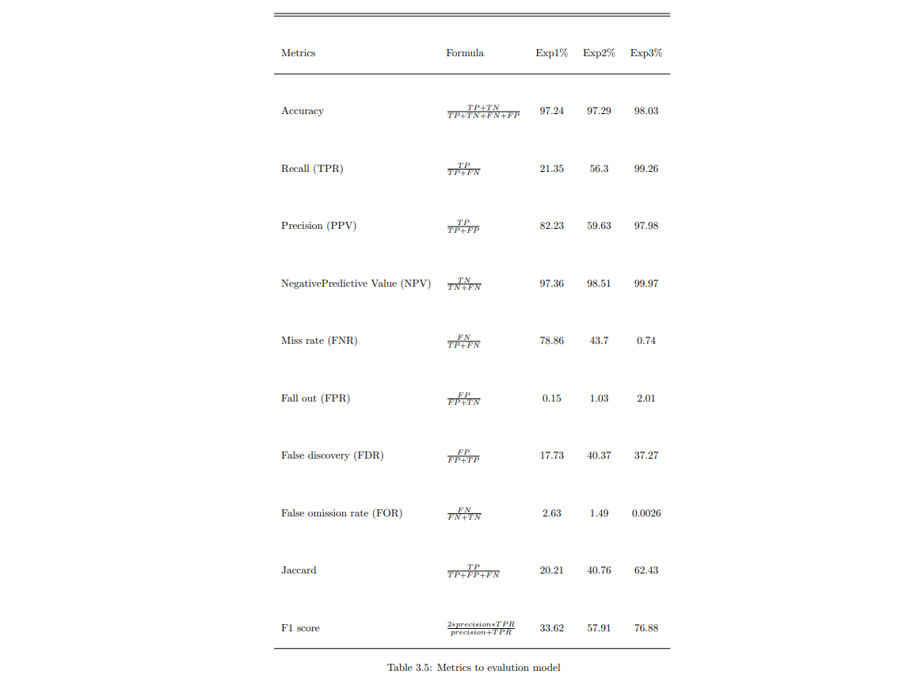
Kết quả phase thứ 2.\
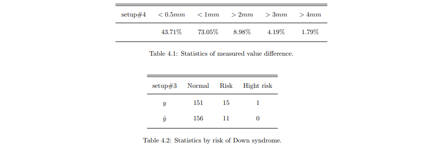
## Conclusion
- Khóa luận đã hoàn thành các yêu cầu đưa ra.
- Sẽ tiếp tục cải tiến tiếp trong tương lại.
